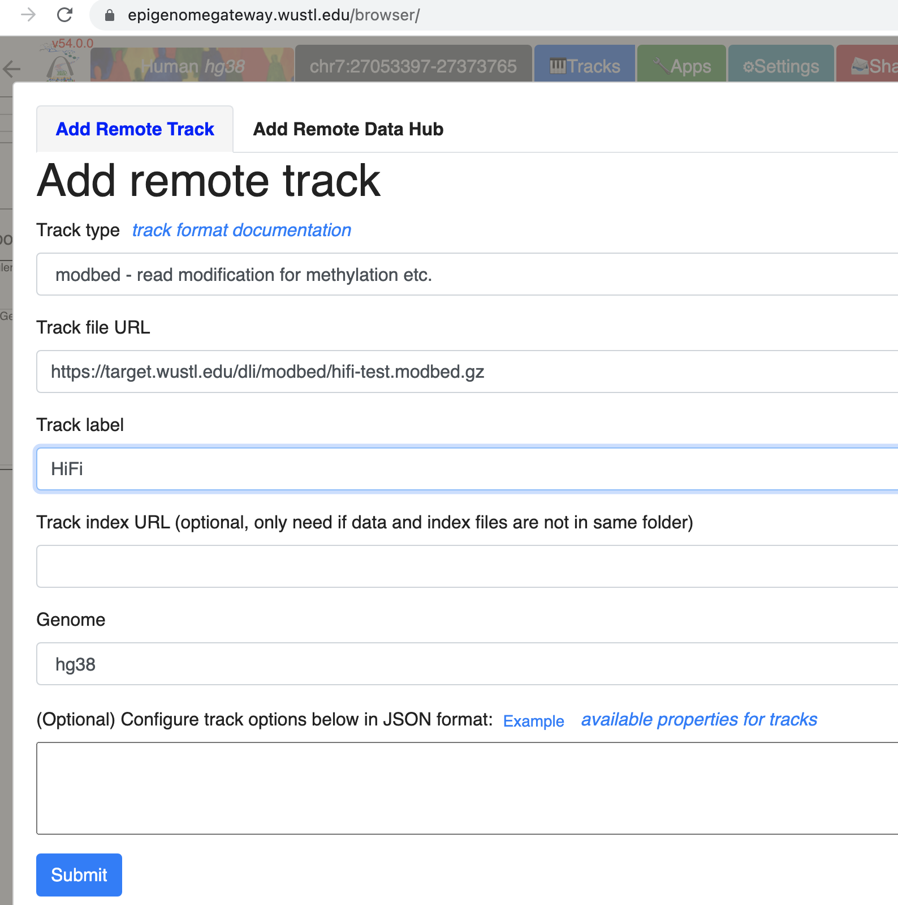
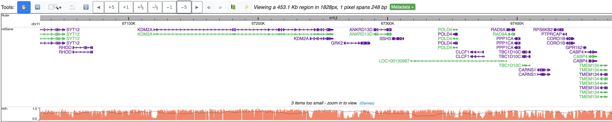
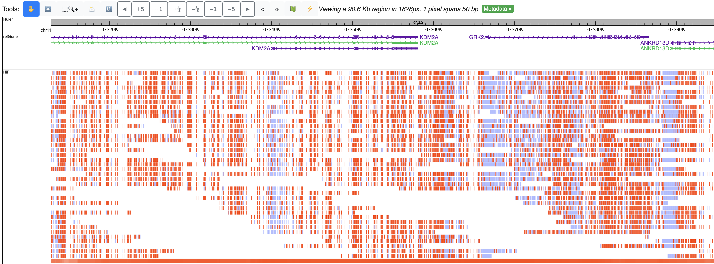

# modbedtools

Requires Python >= 3.6

A python command line tool to generate modbed files for visualization on [WashU Epigenome Browser](https://epigenomegateway.wustl.edu/).

This tool parses MM/ML tag from BAM files generated from 3rd generation sequencing platform like [Oxford Nanopore](https://nanoporetech.com/applications/investigation/epigenetics) and [PacBio](https://www.pacb.com/products-and-services/applications/epigenetics/) devices using the [pysam](https://pysam.readthedocs.io/en/latest) package.

## installation

Install through [pypi modbedtools project page](https://pypi.org/project/modbedtools/) (version number might change):

```
$ pip install modbedtools
Collecting modbedtools
  Downloading modbedtools-0.1.0-py3-none-any.whl (6.8 kB)
Requirement already satisfied: pysam in /opt/apps/python3/lib/python3.7/site-packages (from modbedtools) (0.19.1)
Installing collected packages: modbedtools
Successfully installed modbedtools-0.1.0
```

## modbed format

```sh
chr11   5173273 5195306 -110,-266,-1459,-1780,-1840,-1842,-1848,-1865,-1928,-1936,... -396,-1543,-3222,-4195,-4319,-4692,-5352,-5366,-5523,-5838,...
chr11   5174507 5194585 223,605,607,613,630,693,701,936,1761,3369,...  307,544,1280,2017,2859,2994,3116,3249,3790,3935,...
chr11   5174543 5196481 187,271,508,570,576,593,901,1729,2826,3216,...     568,656,664,1985,2961,3083,3703,4115,4286,4882,...
```

Each row in this bed-based format is a long read, the columns are:

* chromosome
* start position of this read
* end position of this read
* methylated/modified base positions, relative to start
* unmethylated/unmodified/canonical base positions, relative to start

All positions are 0 based.

## commands

```bash
modbedtools -h                                                                                    
usage: modbedtools [-h] [--version] {bam2mod,addbg} ...

Python command line tool to generate modbed files for visualization on WashU Epigenome Browser.

optional arguments:
  -h, --help       show this help message and exit
  --version, -v    show program's version number and exit

subcommands:
  valid subcommands

  {bam2mod,addbg}  additional help
    bam2mod        convert bam to modbed
    addbg          add backgroud bases given modified bases and reference sequence
```

(files for testing can be found in the *test* folder in this repository)

### bam2mod

convert bam files with MM/ML tags to modbed format.

```bash
modbedtools bam2mod -h             
usage: modbedtools bam2mod [-h] [-c CUTOFF] [-o OUTPUT] bamfile

positional arguments:
  bamfile               bam file with MM/ML tags

optional arguments:
  -h, --help            show this help message and exit
  -c CUTOFF, --cutoff CUTOFF
                        methylation cutoff, >= cutoff as methylated. default: 0.5
  -o OUTPUT, --output OUTPUT
                        output file name, a suffix .modbed will be added. default: output
```

examples:

```bash
modbedtools bam2mod hifi-test.bam -o hifi
```

```bash
modbedtools bam2mod remora-test.bam -o remora
```

### addbg

For data provided methylated bases, given a reference genome fasta sequence, add the unmethylated bases from genome sequence as background, **this assumes all other specified bases from genome are unmethylated/unmodified**.

The input file should be in bed format, the last column saves the comma separated relative base position with modification (0 based).

example input:

```sh
chr11   5193360   5212743   {middle columns can be anything or none}    21,273,296,307,440,461,475,688,689,694,863...
```

the data above is adopted from one of the [Fiber-seq](https://www.science.org/doi/abs/10.1126/science.aaz1646) data from [John Stamatoyannopoulos lab](http://www.stamlab.org/).

```bash
modbedtools addbg -b A tracks_ordered_DS182417.txt chr11.fa.gz -o fiber-seq-DS182417
```

## track formating

[Tabix](http://www.htslib.org/doc/tabix.html) is used to compress and index the modbed files generated in last steps.

example:

```sh
bgzip hifi.modbed
tabix -p bed hifi.modbed.gz
```

Then the .gz and .gz.tbi files can be placed into any web server for hosting and the URL to the .gz file can be used for Visualization in [WashU Epigenome Browser](https://epigenomegateway.wustl.edu/).

## visualization

We put some example modbed files on this location (<https://target.wustl.edu/dli/modbed/>) for this tutorial, and we will use <https://target.wustl.edu/dli/modbed/fiber-seq-DS182417.modbed.gz> for the next step by step tutorial.

First we will go to the Browser by navigating your web browser to <https://epigenomegateway.wustl.edu/browser/>, click hg38 for the genome.


In the test data, there are m6A signals around beta globin locus, we will use the gene search function, type in HBG2 and choose the first hit in refGene:


Go to Tracks menu, click Remote Tracks:


Choose modbed from the track type dropdown list, paste the URL above:



This is the default view after you submit this modbed file, each row represents a fiber, each bar on each fiber means methylation level, gray bar indicates there is an adenine base but it’s unmethylated. Mouse over each bar can show the tooltip.


Zoom in 5-fold multiple times, you can see the methylation status at base pair level resolution, each filled circle means methylated, empty circle means unmethylated, orange circle above the line means it’s in + strand, blue in – strand.


Zoom out multiple times from the default view, can clearly view m6A methylation profile over each fiber:


Zoom out further, signals from all fibers are summarized to one bar plot, gray line indicates read/fiber density, bar height means methylation level:



At each view, right click the track, can change view to heatmap style like in IGV:


